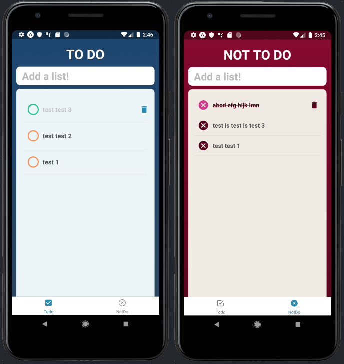

# Q Do List v2
A private todo list app developed using react native. 
A simple todo list app to help you accomplish your tasks. 
A simple todo list app to help you accomplish your tasks. 
Also, not do list helps to repair your bad habits.

    

# React Native Tutorial
You could find tutorials [here](https://facebook.github.io/react-native/docs/getting-started.html).

## Technology Used
1. [React Native](https://facebook.github.io/react-native/)
2. [Expo](https://expo.io/@mahmudahsan)
3. [React Navigation](https://www.npmjs.com/package/react-navigation)

## Features
This is my first react native and expo based project. So I wanted to develop and upgrade a previous project (Q do list by AngluarJS).
But in future I may update it with more feature like authentication, cloud data syncing features and more.

